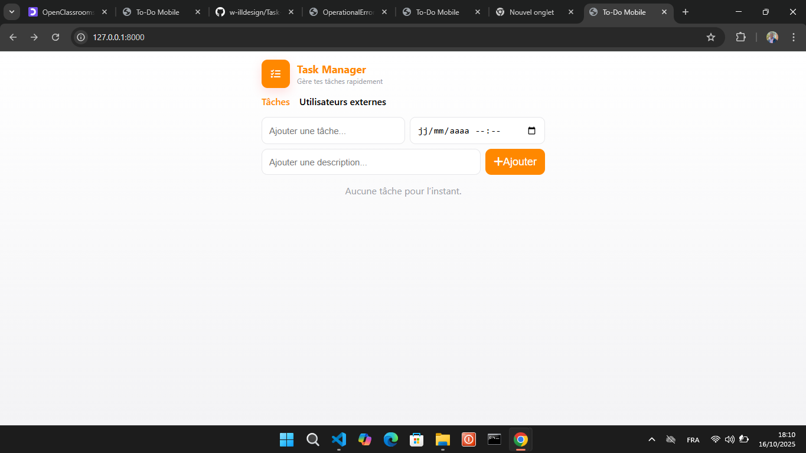
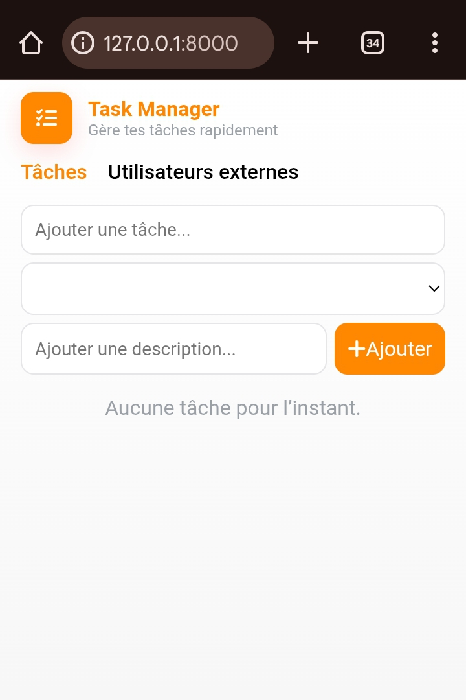

# Task-manager

Task-manager est une application web de gestion de tâches développée avec Django. Elle permet de créer, visualiser, terminer et supprimer des tâches, ainsi que de consulter une liste d’utilisateurs externes récupérée via une API.

#### Affichage desktop


#### Affichage mobil



## Fonctionnalités principales

- Ajouter une tâche avec titre, description et date limite
- Marquer une tâche comme terminée ou la supprimer
- Affichage des tâches en retard ou déjà réalisées
- Liste des utilisateurs externes (affichée via une page dédiée)
- API REST pour les tâches
- Interface responsive


## Installation et utilisation

1. Clonez le dépôt ou copiez les fichiers sur votre machine.
   ```bash
   git clone git@github.com:w-illdesign/Task-manager.git
   cd Task-manager
   ```
2. Créez et activez un environnement virtuel :
   ```bash
   python -m venv env # Pour créer l'environnement virtuel
   source env/Scripts/activate # source env/bin/activate  Sur macOs et Linux
   ```
3. Installez les dépendances :
   ```bash
   pip install django djangorestframework requests tzdata
   ```
4. Appliquez les migrations :
   ```bash
   python manage.py migrate
   ```
5. Lancez le serveur de développement :
   ```bash
   python manage.py runserver
   ```
6. Accédez à l’application sur [http://127.0.0.1:8000/](http://127.0.0.1:8000/)

## Utilisation de l’application

- **Page d’accueil** : gestion des tâches (ajout, suppression, validation) [http://127.0.0.1:8000/](http://127.0.0.1:8000/)

- **Page utilisateurs** : liste des utilisateurs externes via [http://127.0.0.1:8000/users/](http://127.0.0.1:8000/users/)

- **API REST** : accessible via [http://127.0.0.1:8000/api/](http://127.0.0.1:8000/api/)   
Détail d'une tâche sur l'API accessible via le id de la tâche: [http://127.0.0.1:8000/api/id](http://127.0.0.1:8000/api/1/) 

- **Admin Django** : accessible via [http://127.0.0.1:8000/admin/](http://127.0.0.1:8000/admin/)     
Nom d'utilisateur : `admin` Mot de passe : `admin123`


## Structure du projet

- `todolist/` : configuration principale du projet Django
- `tasks/` : application principale (modèles, vues, formulaires, API)
- `templates/tasks/` : templates HTML (`index.html`, `users.html`)
- `db.sqlite3` : base de données SQLite par défaut
- `env/` : environnement virtuel Python (optionnel)


## Points d’entrée du code

- `tasks/models.py` : modèle de données `Task`
- `tasks/views.py` : vues pour l’interface et l’API
- `tasks/forms.py` : formulaire de création de tâche
- `tasks/serializers.py` : sérialisation des tâches pour l’API
- `todolist/urls.py` : routes principales

## Licence

Ce projet est fourni à des fins de démonstration.
